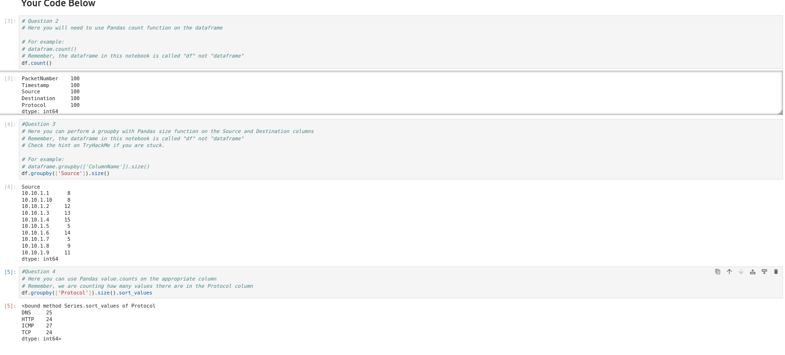

# TryHackMe: Advent of Cyber 2023 - Day 2 Writeup
**Room Link:** [Advent of Cyber 2023](https://tryhackme.com/room/adventofcyber2023)
**Objective:** Apply basic data science concepts using Python and the Pandas library inside Jupyter Notebooks to perform log analysis on captured network traffic.

---

## 1. Overview & Data Processing
In this task, captured network packets formatted in a CSV file were analyzed inside a Jupyter Notebook (`Workbook.ipynb` located in `/4_Capstone`). Python's `pandas` library was utilized to load, inspect, and group the network traffic dataframe (`df`).

---

## 2. Log Analysis via Pandas

### Total Packet Count
To determine the total number of packets present in the dataset, the `count()` method was executed across the dataframe columns.

```python
df.count()
```

**Output:**
```text
PacketNumber    100
Timestamp       100
Source          100
Destination     100
Protocol        100
dtype: int64
```

### Source IP Frequency Analysis
To identify which source IP address generated the highest volume of network traffic, the dataset was grouped by the `Source` column and measured using `size()`.

```python
df.groupby(['Source']).size()
```

**Output Breakdown:**
```text
Source
10.10.1.1      8
10.10.1.10     8
10.10.1.2     12
10.10.1.3     13
10.10.1.4     15
10.10.1.5      5
10.10.1.6     14
10.10.1.7      5
10.10.1.8      9
10.10.1.9     11
dtype: int64
```
*Result:* `10.10.1.4` transmitted the most traffic with 15 captured packets.

### Protocol Frequency Analysis
To evaluate the network protocols present in the capture, the `Protocol` column was aggregated using `groupby()` and sorted.

```python
df.groupby(['Protocol']).size().sort_values()
```

**Output Breakdown:**
```text
DNS     25
HTTP    24
TCP     24
ICMP    27
dtype: int64
```
*Result:* `ICMP` was the most frequent protocol observed (27 packets).

Refer to the screenshot below for the full execution output in the Jupyter Notebook.



---

## 3. Room Objectives & Answers

| Question | Answer |
| :--- | :--- |
| Open the notebook "Workbook" located in the directory "4_Capstone" on the VM. | **No answer needed** |
| How many packets were captured (looking at the PacketNumber)? | `100` |
| What IP address sent the most amount of traffic during the packet capture? | `10.10.1.4` |
| What was the most frequent protocol? | `ICMP` |
| If you enjoyed today's task, check out the Intro to Log Analysis room. | **No answer needed** |
