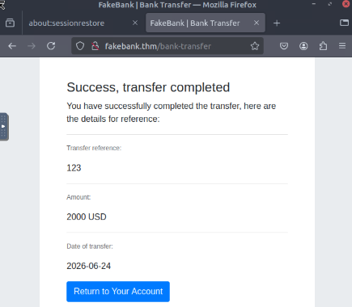

# TryHackMe: Offensive Security Intro Writeup

**Room Link:** [Offensive Security Intro](https://tryhackme.com/room/offensivesecurityintro)  
**Objective:** Understand the high-level workflow of an offensive security specialist by executing a guided web application exploit to retrieve a secret flag.

---

## 1. Reconnaissance & Enumeration
The room introduces GoBuster, a command-line tool used to brute-force open directories and files on a web server to find hidden pages.

```bash
ubuntu@tryhackme:~/Desktop$ gobuster -u [http://fakebank.thm](http://fakebank.thm) -w wordlist.txt dir

=====================================================
Gobuster v2.0.1             OJ Reeves (@TheColonial)
=====================================================
[+] Mode         : dir
[+] Url/Domain   : [http://fakebank.thm/](http://fakebank.thm/)
[+] Threads      : 10
[+] Wordlist     : wordlist.txt
[+] Status codes : 200,204,301,302,307,403
[+] Timeout      : 10s
=====================================================
2026/06/24 15:57:51 Starting gobuster
=====================================================
/images (Status: 301)
/bank-transfer (Status: 200)
=====================================================
2026/06/24 15:58:04 Finished
=====================================================
```

**Discovery:** The scan reveals a highly interesting hidden page: `/bank-transfer` with a `Status: 200` (OK), indicating it is accessible and likely contains the banking interface we need to investigate.

## 2. Exploitation & Foothold
With the hidden area exposed, we navigate to `http://fakebank.thm/bank-transfer` to find the unauthenticated banking portal. 

1. **The Execution:** We manipulate the input parameters on the page to execute an unauthorized transfer of funds from a target account.
2. **The Verification:** The application processes the request without proper authorization checks, confirming a critical broken access control vulnerability.



