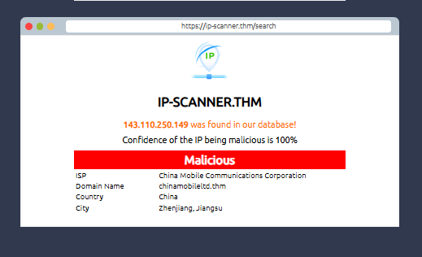
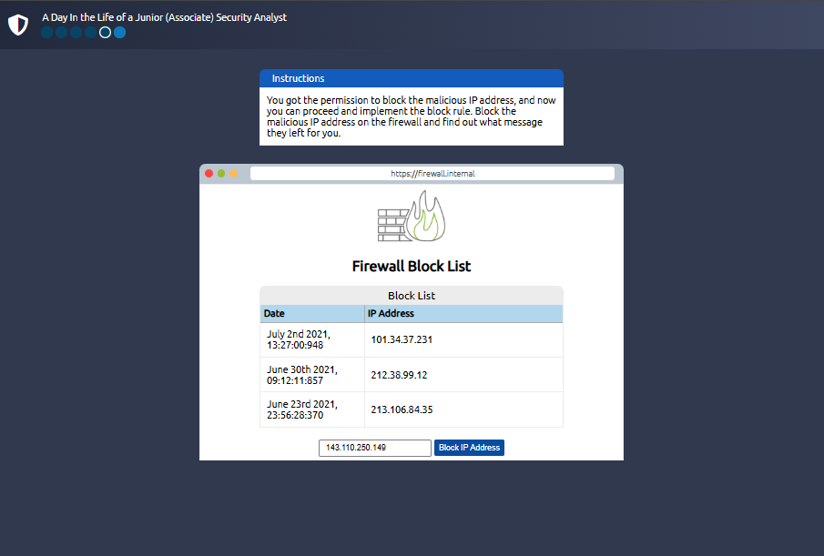

# TryHackMe: Introduction to Defensive Security Writeup
**Room Link:** [Introduction to Defensive Security](https://tryhackme.com/room/introtodefensivesecurity)
**Objective:** Introduce the foundational concepts of defensive security (Blue Teaming), including the roles of a Security Operations Center (SOC), Threat Intelligence, Digital Forensics and Incident Response (DFIR), and Malware Analysis, concluding with a practical analysis and remediation simulation.

---

## 1. Defensive Security Fundamentals
Defensive security focuses on two primary directives: preventing intrusions from occurring, and detecting/responding to intrusions when they do occur. 

### Core Pillars of a Blue Team
* **Security Operations Center (SOC):** A team of cybersecurity professionals responsible for monitoring networks and systems to detect and mitigate malicious events. Key interest areas include identifying system vulnerabilities, catching policy violations, detecting unauthorized activity (e.g., credential theft), and handling network intrusions.
* **Threat Intelligence:** The collection, processing, and analysis of data regarding actual and potential adversaries to achieve a threat-informed defense.
* **Digital Forensics and Incident Response (DFIR):**
    * **Digital Forensics:** The application of science to investigate cybercrimes by analyzing digital evidence across filesystems, system memory, system logs, and network packets.
    * **Incident Response:** The structured methodology followed to handle a data breach or cyber attack. The process follows four major phases: *Preparation*, *Detection and Analysis*, *Containment, Eradication, and Recovery*, and *Post-Incident Activity*.
* **Malware Analysis:** The practice of inspecting and analyzing malicious software (such as viruses, Trojans, or ransomware) using two distinct methods:
    1. **Static Analysis:** Inspecting the malicious program's code or executable features without running it.
    2. **Dynamic Analysis:** Executing the malware within a controlled, isolated environment to monitor its behavior safely.

---

## 2. Practical Simulation: Incident Response & Mitigation
To simulate the responsibilities of a Junior Security Analyst, a multi-stage incident response exercise was completed.

### Threat Intelligence & IP Verification
An active alert flagged an anomalous IP address interacting with the network infrastructure. Using an internal threat intelligence database tool (`ip-scanner.thm`), the address was investigated:

* **Target IP:** `143.110.250.149`
* **ISP:** China Mobile Communications Corporation
* **Domain Name:** `chinamobileltd.thm`
* **Malicious Confidence Score:** 100%

Refer to the image below for the threat database output.



### Perimeter Containment (Firewall Implementation)
With 100% confirmation of malicious intent, permission was granted to deploy an emergency block rule on the edge firewall. 

The firewall management panel (`https://firewall.internal`) was accessed, and the malicious indicator was appended directly into the active blocklist rulebase. 

Refer to the image below for the active block list configuration interface before execution.



---

## 3. Flag Capture & Verification
Upon successful validation of the new perimeter firewall rule, the threat was successfully neutralized, and the confirmation flag was captured.

Refer to the image below for the final verification interface.


```text
THM{THREAT-BLOCKED}
